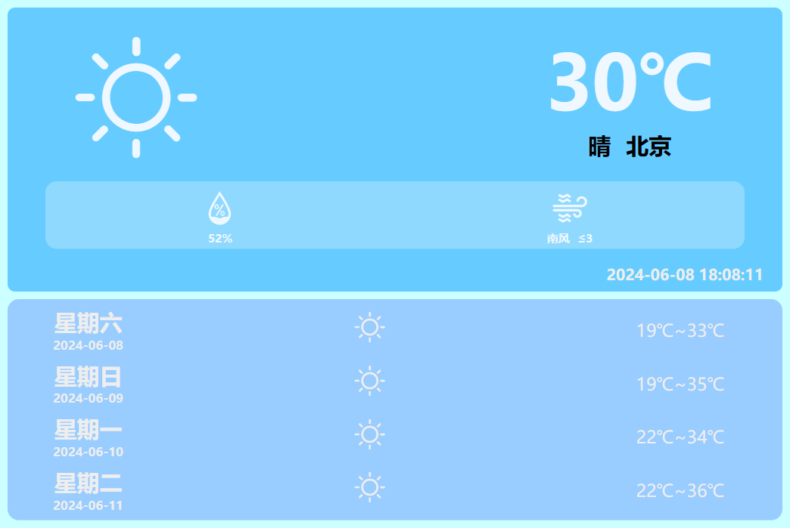
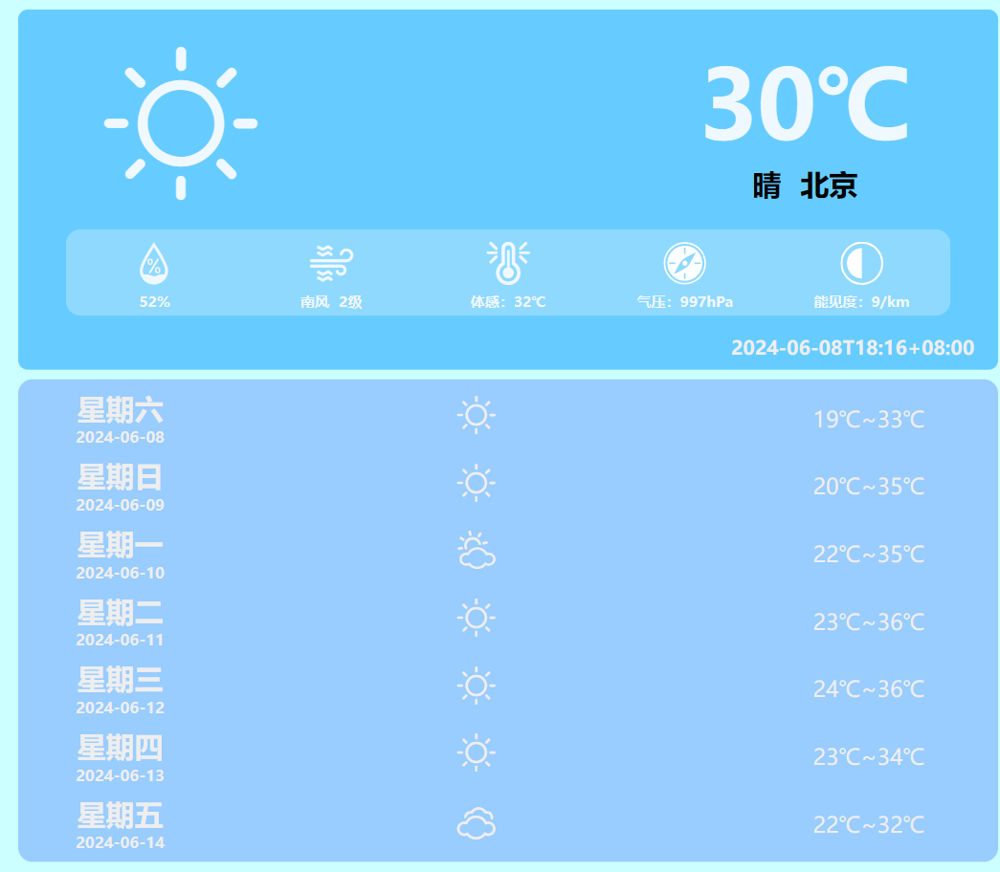

<div align="center">


<a width= "100px" href="https://v2.nonebot.dev/store"></a>
</p>

# nonebot-plugin-xjie-weather

_✨一个 NoneBot 天气插件✨_


</div>

# 安装

- 使用 nb-cli

```
nb plugin install nonebot-plugin-xjie-weather
```

- 使用 pip

```
pip install nonebot-plugin-xjie-weather
```

# 支持
目前支持

| API              | 是否支持    |   调用天气预报   |  城市编码获取|
| :--------------: | :--------: | :-------: |  :-------:|
| 高德天气         | 支持✅     | 300000次|   5000次/天
| 和风天气         | 支持✅   |  1000次/天 | 和前面次数共用
| Visual Crossing | 未完成❌   |
| 心知天气         | 未完成❌  |

# BUG反馈
请提```issues```或邮箱```1095530449@qq.com```

# 配置
### 一
- 使用```st```命令交互式设置key

```
AMAP_KEY         高德
QWEATHER_KEY     和风天气
```
如果有多个key想使用哪个或者在一个平台的调用次数用完后可以进行切换
```
default_api     优先使用的平台

手动填入的话平台名为上面的key名
```


# 平台key获取
 [📦 高德](/amap.md)

 <!-- [📦 和风天气](/heweather.md) -->

 # 插件返回的天气预报图片效果

 ## 高德

高德地图返回的天气数据种类不多但对于只看个天气预报而已的完全够

毕竟高德调用的次数挺多的



## 和风天气
好看

